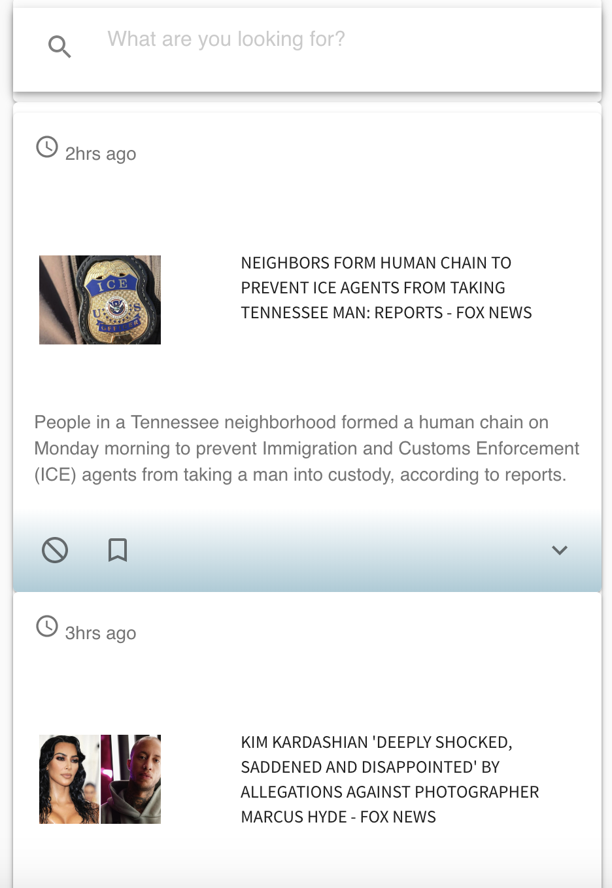

# Perch

Perch is an open, collaborative and changing product to help online news readers feel in control of their information consumption, and to provide tools to help readers better assess news.

Currently the project displays trending news in the United States. Readers can view the descriptions of the news articles as well as follow links to view the full articles. Readers can also search for keywords and articles containing the keywords can be viewed.

To Do:
Add user accounts so that readers can bookmark articles, compare articles, or block certain topics.




### Installing

```
git clone https://github.com/how-i-can/news
cd news/server
npm install
npm install firebase

cd ../client
npm install
npm install -g nodemon
```

### Configuring

#### News API Key

Go to https://newsapi.org and register for an API key.

Create `.env` file within `server/` directory

```
touch .env
```

Add your News API key to the `.env` file*

```
NEWS_API_KEY=yourkey
```

***Note:** Please check the file `.env-example` for an example on how to add the required environment keys to your own `.env` file.

#### Setup Firebase

1. Create an account at https://firebase.google.com/

2. Click `Go to console` in the right upper corner

3. Click `Create a project` > name it ‘perch’ > disable Google Analytics > click `Create project` > click `Continue`

4. In the menu on the left, click `Develop` and then `Authentication`

5. Click `Set up sign-in method`

6. Under `Sign-in providers`, click `Email/Password` > `Enable` the option > click `Save`

7. Back in the left-hand menu, find the gear icon next to `Project Overview`, click it, and then select `Project settings`

8. In your local repository, add the `Web API Key` and `Project ID` (from step 7) to your `.env` file*

```
FIREBASE_API_KEY=yourkey
FIREBASE_PROJECT_ID=yourid
```

***Note:** Please check the file `.env-example` for an example on how to add the required environment keys to your own `.env` file.

It's okay to leave the fields blank where no values exist because we currently don't utilize all the Firebase functionality.

### Launching

Start server using the CLI from the directory: `news/server`
```
cd ../server
npm start
```

Navigate to http://localhost:4000/ from a web browser to confirm the server is running. You should see {"message": "working"}.

Launch client using the CLI from the directory: `news/client`
```
cd ../client
npm start
```

A browser should load to http://localhost:3000/ where the news app will be loaded.


## Built With

- [Express](https://expressjs.com/en/starter/installing.html) - The web framework for Node.js
- [React](https://reactjs.org/) - A JavaScript library for building user interfaces
- [create-react-app](https://github.com/facebook/create-react-app) - Set up a modern web app by running one command.
- [axios](https://github.com/axios/axios) - Promise based HTTP client for the browser and node.js
- [News API](https://newsapi.org/) - News API is a simple HTTP REST API for searching and retrieving live articles from all over the web

## License

Licensed under the Apache License, Version 2.0 (the "License");
You may view a copy of the License at the [LICENSE.md](LICENSE.md) file

Copyright 2019 How I Can

## Acknowledgments
This project was built during a How I can cohort. Come check out [How I Can](http://howican.tech/)
for more details.

Please view our [Wiki](https://github.com/how-i-can/news/wiki) for documentation on the cohort and the AGILE-like process.
